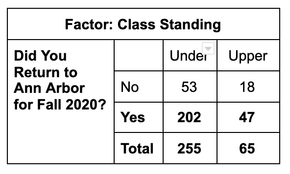
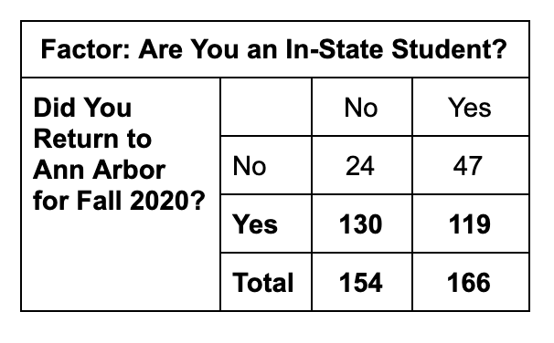
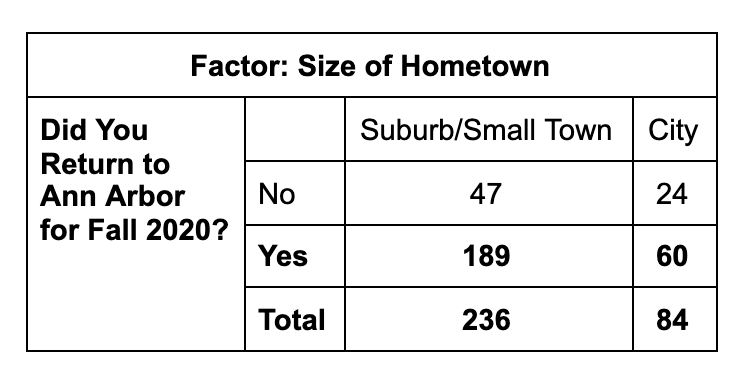
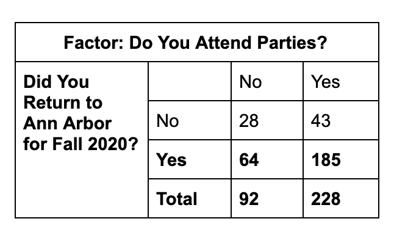

```{r setup, include = FALSE}
knitr::opts_chunk$set(echo = TRUE)
```

## Question 1: MWrite

This week, in preparation for your second MWrite Prompt, we will use summaries from a data set constructed from a random sample of the Stats 250 Fall 2020 Student Survey (if you filled it out, you may be part of this dataset!)

The data set `stats250survey` contains the following list of variables:

| Variable name | Description |
|:--------------|:----------------------------------------|
|`AA.Return`| Returned to Ann Arbor originally for Fall 2020 (Yes, No) |
|`Class.Status`| Class Standing (Under, Upper) |
|`In.State.Status`| U-M residency status (Yes = In-State, No = Out-of-State Domestic & International) |
|`Hometown.Status`| Type of hometown (City, Suburb/Small Town) |
|`Party.Attend`| Goes to parties (Yes, No) |


<hr />

Summaries of the data are provided here:

{width=300px}

{width=300px}

{width=350px}

{width=300px}

You are asked to select *two* variables that are associated with a student's decision to come to Ann Arbor to perform a statistical analysis on, generating inference output from RStudio.  To help you out, we've included two functions below that calculate confidence intervals and hypothesis tests.

### Helpful Functions

In Lab 7, we created a function that generates a confidence interval for the difference in two population proportions. If you're interested, check out the code below (and feel free to ask questions about it via Piazza).  

```{r twoPopPropCIfunction, echo = FALSE}

twoPopPropCI <- function(x1, n1, x2, n2, confidence = 0.95){
  
  # Calculates the sample proportions
  phat1 <- x1 / n1
  phat2 <- x2 / n2
  
  # Calculates the standard error
  se.phats <- sqrt(((phat1 * (1 - phat1)) / n1) + ((phat2 * (1 - phat2)) / n2))
  
  # Finds the z* multiplier
  z.multiplier <- qnorm((1 - confidence) / 2, lower.tail = FALSE)
  
  # Calculates the lower and upper bound of the interval
  lower.bound <- (phat1 - phat2) - z.multiplier*se.phats
  upper.bound <- (phat1 - phat2) + z.multiplier*se.phats
  
  # Returns a sentence with the results
  return(paste("The ", confidence*100, "% confidence interval is given as: (", 
               round(lower.bound,4), ", ", round(upper.bound,4),").", sep = ""))
}

```

The above code creates a function called `twoPopPropCI()` and has five arguments:

1. `x1`: observed number of "successes" for group 1
2. `n1`: sample size for group 1
3. `x2`: observed number of "successes" for group 2
4. `n2`: sample size for group 2
5. `confidence`: confidence level (if left empty, a default of 0.95 will be used)

Once a user provides these five arguments, the function will use R to calculate the confidence interval. 

Similarly, we created a function in Lab 7 that calculates important values for a hypothesis test involving the difference in two population proportions. You do still need to check the assumptions before this function performs the calculations for you. If you're interested, check out the code below (and feel free to ask questions about it via Piazza).

```{r twoPopPropHTfunction, echo = FALSE}

twoPopPropHT <- function(x1, n1, x2, n2, alt = "two.sided"){
  
  # Calculates the sample proportions 
  phat1 <- x1 / n1
  phat2 <- x2 / n2
  
  # Calculates the estimate of the common population proportion
  phat <- ((n1 * phat1) + (n2 * phat2)) / (n1 + n2)
  
  # Calculates the null standard error
  null.se <- sqrt((phat * (1 - phat)) * ((1 / n1) + (1 / n2)))
  
  # Calculates the z test statistic
  z.test.stat <- (phat1 - phat2) / null.se
  
  # Calculates the p-value (based on the alternative hypothesis provided - default is two-sided)
  if (alt == "greater") {p.value <- pnorm(z.test.stat, lower.tail = FALSE)
  } else if (alt == "less") {p.value <- pnorm(z.test.stat, lower.tail = TRUE)
  } else if (alt == "two.sided") {p.value <- 2 * pnorm(abs(z.test.stat), lower.tail = FALSE)
  }
  
  # Returns list of helpful values
  return(list("phat1" = phat1, "phat2" = phat2, "phat" = phat, 
              "null.se" = null.se, "z.test.stat" = z.test.stat, "p.value" = p.value))
}
```

The above code creates a function called `twoPopPropHT()` and has five arguments:

1. `x1`: observed number of "successes" for group 1
2. `n1`: sample size for group 1
3. `x2`: observed number of "successes" for group 2
4. `n2`: sample size for group 2
5. `alt`: direction of the alternative hypothesis ("less", "greater", or "two.sided") (if left empty, a two-sided alternative will be used)

Note: you must input the argument of `alt` *exactly* as one of the three specified options 

Once a user provides these arguments, the function will use R to calculate the individual components of the hypothesis test and then return the final p-value.

### Question 1, Part a

Pick one variable from the options to learn how this variable is associated with returning to Ann Arbor for Fall 2020.  In particular, generate inference output in the form of either a confidence interval or a hypothesis test to include in Question 1 part a.  Once you've generated this output, include it as a screenshot or copy and paste your results into the course.work question.  Be sure to answer the follow up questions on course.work.

```{r Q1a, error = T}
# Replace this comment with your code or add it to the next line

```

### Question 1, Part b

Pick a second variable from the options to learn how this variable is associated with returning to Ann Arbor for Fall 2020.  In particular, generate inference output in the form of either a confidence interval or a hypothesis test to include in Question 1 part a.  Once you've generated this output, include it as a screenshot or copy and paste your results into the course.work question.  Be sure to answer the follow up questions on course.work.

```{r Q1b, error = T}
# Replace this comment with your code or add it to the next line

```


## Question 2

This question uses the `Internetsecurity` data that contains information about the number of hours per week each employee uses the internet for nonbusiness purposes during working hours.  Below, we read in the data and provide a quick preview of the dataset.

```{r Q2, error = T}
load("Internetsecurity.RData")
head(Internetsecurity)
```

Use the t.test function to calculate a 98% confidence interval for the amount of time each week each employee uses the internet for nonbusiness purposes.

```{r Q2_CI, error = T}
# Replace this comment with your code or add it to the next line

```


## Question 3

This question uses the `moviesperyear` data, which contains the result of the survey of randomly selected Millennials, asking them how many movies they watched in a movie theater in 2018.  Below, we read in the data and provide a quick preview of the dataset.

```{r Q3, error = T}
load("moviesperyear.RData")
head(moviesperyear)
```

### Question 3, Part a

We are told that a random sample of Millennials was taken, to complete the first assumption needed. The remaining assumption needs to be stated and checked.  You can provide the statement directly on course.work.  Create a graphical display to check the remaining assumption.  (Friendly reminder: all graphical displays need an appropriate title and author's name.)

```{r Q3a, error = T}
# Replace this comment with your code or add it to the next line

```

### Question 3, Part b

Provide the value that best completes the following statement:

The sample mean number of movies watched by Millennials at a theater in 2018 is __________ standard errors away from the hypothesized population mean number of movies watched by Millenials at a theater in 2018.

```{r Q3b, error = T}
# Replace this comment with your code or add it to the next line

```

## Wrapping Up

Make sure that you submit the appropriate output from this RStudio Project to the corresponding questions on course.work.